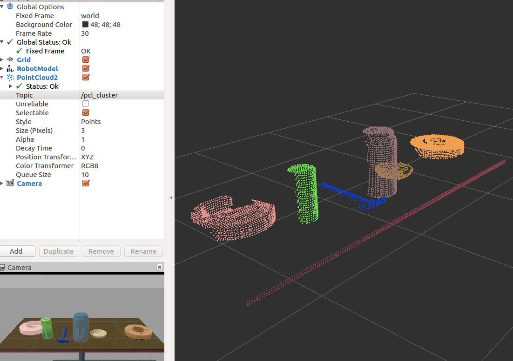
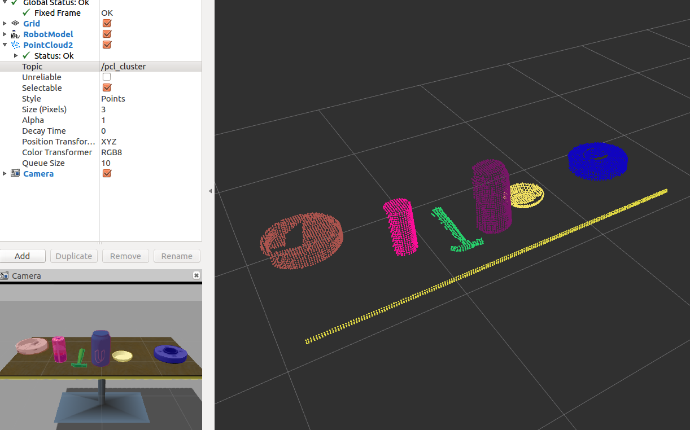

# point-cloud-clusters

I apply a clustering technique called DBSCAN to identify which points in a point cloud belong to the same object.

- This is the [second perception exercise](https://github.com/udacity/RoboND-Perception-Exercises/tree/master/Exercise-2) 
from [Udacity's RoboND](https://www.udacity.com/robotics).

- This builds upon my [solution for the first perception exercise](https://github.com/mithi/point-cloud-filter) 
where I apply techniques to separate our objects of interest.

# Important Files
- [Clustering Script](./src/sensor_stick/scripts/clustering.py)
- [Filtering Helper Functions](./src/sensor_stick/scripts/filtering_helper.py)
- [Other PCL Functions](./src/sensor_stick/scripts/pcl_helper.py)

# Related links
You can learn more about [PCL here](http://pointclouds.org/documentation/tutorials/).
You can learn more about DBSCAN in the following links:
- [Naftali Harris: Visualizing DBSCAN Clustering](https://www.naftaliharris.com/blog/visualizing-dbscan-clustering/)
- [SKLearn DBSCAN Plot](http://scikit-learn.org/stable/auto_examples/cluster/plot_dbscan.html)

# Dependencies
- You need an Ubuntu 16.04.2 with ROS full-desktop-version which includes RViz and Gazebo
- You must clone the repository, go inside the directory and install the dependencies:
```
$ rosdep install --from-paths src --ignore-src --rosdistro=kinetic -y
$ catkin_make
```
 - Add the following to your `.bashrc` file:
 ```
export GAZEBO_MODEL_PATH=~/catkin_ws/src/sensor_stick/models
source ~/catkin_ws/devel/setup.bash
```

# How to Run
- On one terminal run `$ roslaunch sensor_stick robot_spawn.launch` 
- On another terminal go inside `/src/sensor_stick/scripts/` folder in this repository
- Then run `$ python clustering.py`
- `RViz` should run, select the `/pcl_cluster` from the **Topics dropdown**




